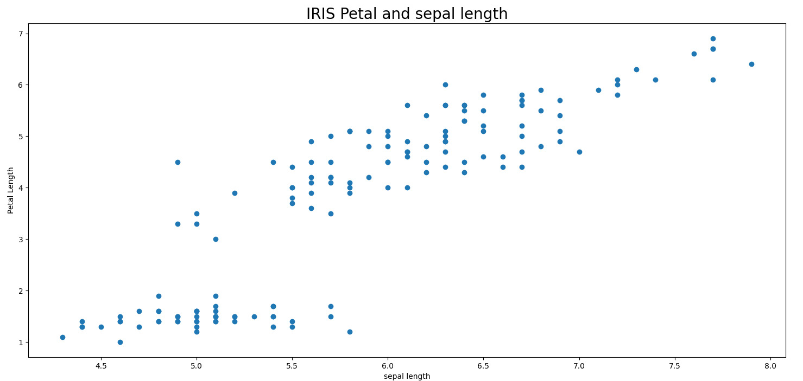
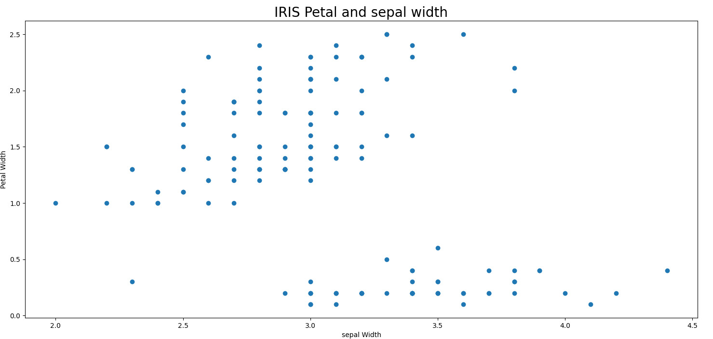
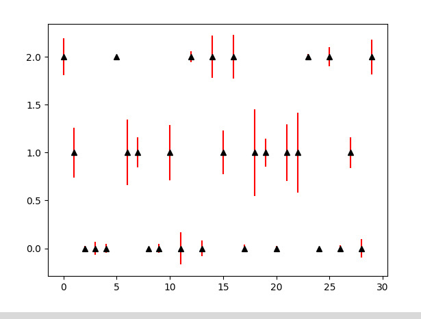
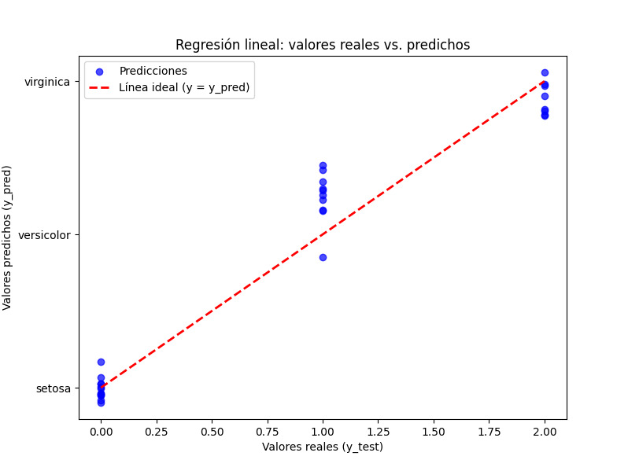
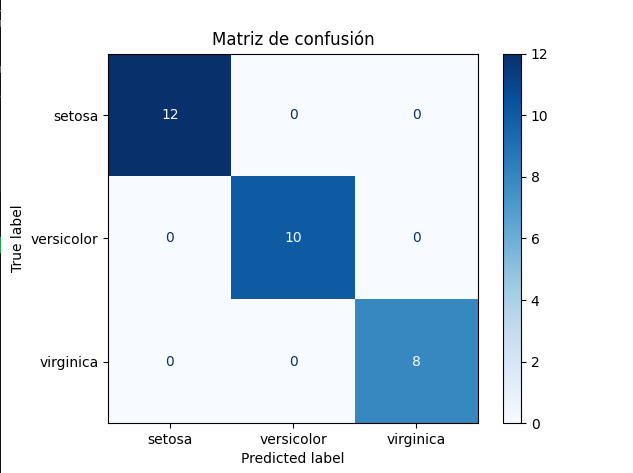
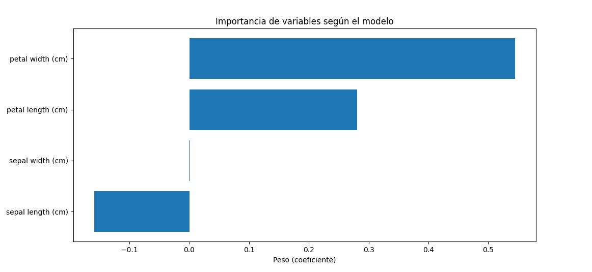

*David Santiago Sierra Fernández, Oscar Felipe Valcárcel Peralta*

# Regresión Lineal Múltiple

## 1. Introducción 
Esto es un ejercico práctico de una regresión lineal múltiple usando la librería de `sklearn` en `python`, se uso un dataset propio de la librería el cual contenia datos de tres especies de flores de la misma familia (setosa, versicolor, virginica), la idea es utilizar los datos del tamaño del tallo y de los pétalos para predecir o identificar la especie de la flor iris.

### 1.1. Objetivo
El objetivo de esta práctica es identificar las tres especies de la flor iris con el mínimo error posible haciendo uso de la regresión lineal múltiple. 

## 2. Preparación del Modelo
Para el entrenamiento de este modelo se usaron las libreríaas de `sklearn` y `numpy` para manejar y entrenar los datos.

### 2.1. Preprocesamiento de los datos
En esta práctica los datos que se tienen son todos cuantificables, por lo cual no es necesario hacerles un tratamiento especial a cada uno, se utilizará la función de `LinearRegression()`, ya que hacer las predicciones con esta función hace parte de el objetivo de la práctica. 

Para usar los datos en el modelo se tomaron las longitudes (ancho y alto) del tallo y los pétalos, estos se dividieron para entregarle un 80% de datos para el entrenamiento y un 20% para hacer el testing del modelo, la predicción se hace sobre la especie de la flor, a continuación se pueden ver los gráficos de dispersión de los datos del pétalo con respecto al tallo.

En ambos conjuntos de datos se pueden evidenciar correlaciones positivas entre los datos de entrada, aunque también se notan muy dispersos, lo cual puede ser un indicativo de que pueden llegar a ser secillas de clasificar.

### 2.2. Entrenamiento del modelo

Una vez separados los datos de test y de entrenamiento se continúa declarando la función que hace el entrenamiento, es decir `fit()`, a la cuál le asignamos los datos de entrada y los datos objetivo.

Después de haber sido ejecutado, el módelo se guarda en `y_pred`con la función `predict()`, luego de esto calculamos el error obtenido del modelo con f1 score.

## 3. Resultados
Al ver los resultados obtenidos tras varias ejecuciones se puede evidenciar que el modelo esta muy bien, ya que en la mayoría de intentos se obtiene un 100% de confiabilidad, a continuación se comparten los resultados de uno de los modelos entrenados con éxito.

### 3.1. Error del Modelo
En cuanto al f1 score y la precisión del módelo se vio un **100%** de fiabilidad y un **0%** de error, en este intento el modelo es capaz de acertar la especie de todos los datos de test.

Para identificar el error del módelo con más precisión se hizo un gráfico de barras de error, este se puede ver a continuación:

En este gráfico se puede ver que las barras se extienden desde un punto el cual es el esperado, pero si las barras son tan largas, ¿por qué el módelo tiene un 100% de precisión?, esto es porque las barras se encuentran dentro de lo que se llama una zona de fiabilidad, lo cual quiere decir que cuando el módelo da como respuesta un número que esta entre cierto rango este se apróxima automáticamente a este punto más cercano, además de esto las barras no se extienden lo suficiente como para cruzarce en el mismo punto de predicción.

### 3.2. Evaluación del Modelo

El resultado de la regresión se graficó de la siguiente manera:

En el gráfico anterior se puede ver que la solución pasa casi por la mitad de las soluciones esperadas, esta línea intenta pasar por la mitad precisamente para hacer lo que se comentó en el anterior punto y darle un margen de fiabilidad a las predicciones.

La matriz de confusión de este entrenamiento evidencia el 100% de aciertos que se obtuvo a la hora de poner a prueba el modelo, la matriz se puede ver acontinuación:

Finalmente se hizo un gráfico para verificar la importancia que tuvo cada feature dentro del modelo:

En este gráfico se puede observar que el peso con más influencia en la predicción el el ancho de los pétalos, seguido por la longitud de los mismos, lo cual nos da a entender que la mejor manera de clasificar las especies de la flor iris esta en el tamaño de sus pétalos, también se puede observar que el ancho del tallo no tuvo casi influencia, esto debe ser debido a que el ancho de un tallo de flor normalmente es muy pequeño y suele ser casi el mismo en cualquier tipo de flor, sin embargo a pesar de tener una influencia negativa no se puede despreciar el dato de la longitud del tallo ya que este es el que terminar de balancear la respuesta de la especie de la flor. 

### 3.3. Conclusiones

Se puede despreciar el dato del ancho del tallo sin llegar a dañar el modelo, haciendo una pequeña revisión de algunos otros intentos se vio que cuando la precisión del modelo no era del 100% el peso del ancho del tallo estaba influyendo bastante en la respuesta, por lo cual se cree que si este dato se despreciara para entrenar modelos con este dataset y utilizando la regresión lineal puede llegar a ser beneficioso.  