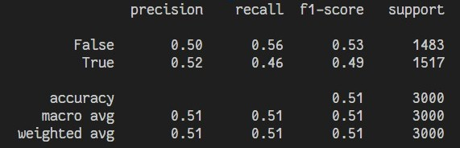
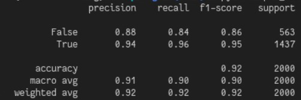
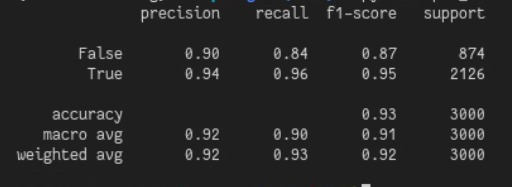
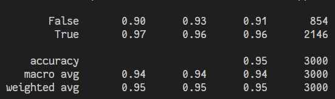
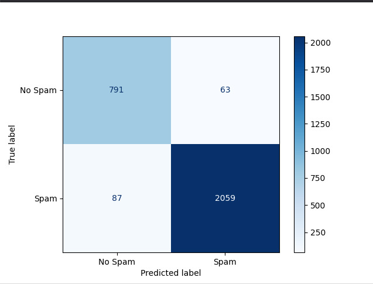

*Sierra Fernández David Santiago, Valcárcel Peralta Oscar Felipe*
# Identificación de Spam Usando Regresión Logística
[Repositorio Github](https://github.com/santorar/MachineLearning)
## 1. Introducción
Esto es una práctica de machine learning, donde buscámos desarrollar un programa en Python haciendo uso de la librería sklearn que pueda clasificar **spam** o **ham** utilizando el algoritmo de **regresión logística**.

### 1.1 Objetivo
El objetivo principal es entrenar un modelo que tras analizar lod features de un conjunto de mensajes previamente etiquetados, sea capaz de predecir con un grado de certeza aceptable si un nuevo mensaje que no halla visto antes es spam o no.

## 2. Preparación de los datos
### 2.1 Features Usados
1. **Palabras Clave:** texto
2. **Link:** texto
3. **Dominio:** Categorias
4. **Autentificación:** Categorias
5. **Correos recibidos del mismo remitente:** numérico
6. **Reputación IP:** numérico
7. **Participación positiva:** numérico
8. **Blacklisted:** booleano

### 2.2 Features Descartados
1. **Asunto:** Fue descartada porque las palabras clave cumplen con la misma fución de encontrar esas palabras sospechosas que pueden llegar a ser propias del spam.
2. **Cuerpo:** Fue descaratada por que tanto las palabras clave como los links ya cumplen la función de identificar si el contenido es sospechoso.
3. **Remitente:** Se descartó el uso de este feature porque tanto el dominio, la utentificación y la marca de blacklist ya cumplen con ser subcaracterísticas del remitente y al ser más específicas y más fáciles de cuantificar hacen que el remitente quede en un segundo plano.
4. **IP del Remitente:** Esta al igual que con el remitente ya está siendo caracterizada por otros features más específicos.

## 3. Entrenamiento del modelo
Para el entrenamiento del modelo, lo primero que se hizo pfue separar los datos de entrada de la salida, luego se separaron los features en 4 subcategorías, las cuales son texto `text_features`, categóricas `cat_features`, numéricas `num_features` y booleanas `bool_features`.

### 3.1 Preprocesamiento

Para las variables de texto se hace un vector númerico, la función `TfidfVectorizer()` mide la importancia de cada palabra tanto por su frecuencia como por lo rara que es dentro del conjunto de datos.

La función `OneHotEncoder()` le da un número a cada categoría diferente dentro de la misma caracterísca.

la función `StandardScaler()` estandariza las variables númericas y las hace más pequeñas para evitar que el modelo se demore demasiado en entrenarse gracias a que se utiliza la función logística este paso es sumamente necesario, si no se hace el modelo puede nunca llegar a encontrar una respuesta.

Para los booleanos simplemente se convierten en 1 o 0 para verdadero y falso.

### 3.2 Entrenamiento de modelo

Para el entranamiento se uso la función del `sklearn` `train_test_split`, el cual baraja y toma un 30% del dataset para pruebas y un 70% para el entrenamiento, luego con la función `model.predict()` para guardar los datos de la predicción en `y` y asi poder mostrarlos.

## 4. Evaluación del Modelo
En una primera instancia el modelo se entrenó con el dataset `correos_dataset.csv` pero este dataset tenia un problema, el etiquetado de **spam** o **ham**, se puso aleatoriamente, lo cual daba como resultado la imagen a continuación.

En la imagen se puede notar que el f1 score, el cual es la precisión del modelo o el porcentaje de aciertos nos marca un 53% de aciertos para **ham** y un 49% de aciertos para **spam**, al principio se penso que era un error con el entrenamiento del modelo, sin embargo al revisar la manera en la cual se generaron las etiquetas, se denotó que se puso de manera aleatoria la marca de spam, lo cual hacia que el dataset en sí estuviera mal ya que no habíá ningún patrón definible.

Finalmente se genero un nuevo dataset que siguiera mejor una lógica de un correo que es spam y uno que no, en este caso es el dataset llamado `prueba_dataset.csv`, el cual al ejecutarlo nos dio las siguientes respuestas.

#### Intento 1

En este nuevo intento se vio una precisión de **92%** donde se tenie un porcentaje de aciertos de **86%** para **ham** y **95%** para **spam**.

#### Intento 2

En este intento se obtuvo una precisión de **93%** donde se puede denotar que hay un **87%** de aciertos para **ham** y **95%** de aciertos para **spam**.

#### Intento 3

En este intento se denotó una precisión más alta, siendo esta del **95%** donde se tiene un porcentahe de aciertos de **91%** para **ham** y de **96%** de **spam**.

Esta es la matriz de confusión de este intento con el cual nos quedaremos, los resultados de los pesos se encuentran dentro del archivo `model_spam_3.pk1`.