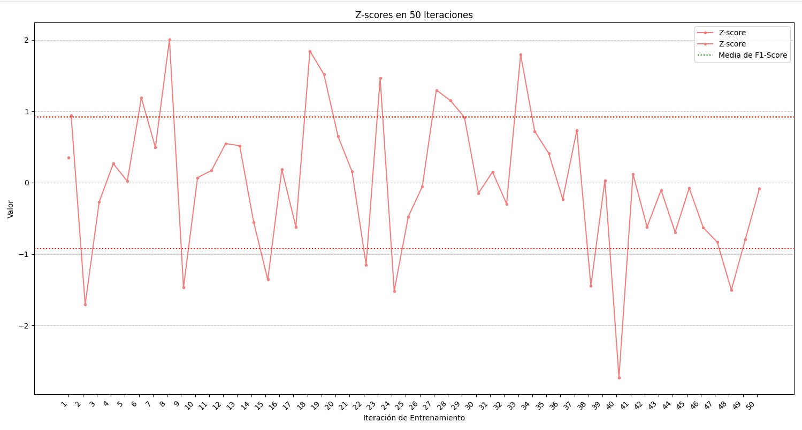

# Clasificación de Spam Utilizando Árboles de Decisión.
 
 Integrantes: *David Santiago Sierra Fernández, Oscar Felipe Valcárcel Peralta 
 
 **Link del Repositorio: https://github.com/santorar/MachineLearning/tree/main/spam-decision-tree.** 
 
## 1. Introducción 

El correo no deseado (spam) representa un problema persistente en la comunicación digital. Esta práctica aborda el desarrollo de un clasificador de spam basado en un modelo de árbol de decisión se hará uso de la libreria `sklearn` de python.

### 1.1. Objetivo

El objetivo principal es alcanzar el máximo rendimiento posible, medido a través de métricas de clasificación clave como la puntuación F1, la precisión (accuracy) y el z-score.

## 2. Preparación del Modelo

El modelo que se va a utilizar es un árbol de decisiones, este árbol guiará las decisiones por medio del índice de Gini, a continuación se explicará más a detalle el funcionamiento del modelo.

### 2.1. Preparación de los datos

Como primer paso llamamos el dataset el cual en esta practica es llamado `prueba_dataset.csv`,  además para evitar valores `null` se le asignan strings vacíos a las features de `palabras_clave` y `links` esto para que no se rompa el modelo y pueda tratar estos datos.

Luego de esto asignamos las entradas del modelo (`X`) y las salidas deseadas (`y`), una vez separadas entradas y salidas se separan los features en 4 subgrupos, los cuales son features de texto, categóricos, numéricos y boleanos. 

Finalmente se pasan las features de palabras clave y links por la función `TfidVectorizer()` la cual convierte en vectores numéricos las cadenas de texto dando un valor más alto a aquellas palabras que son raras dentro del contexto de los datos, para las features categóricas se pasan por `oneHotEncoder()`, el cual da valores numéricos a las diferentes categorías de un conjunto de datos.

#### 2.1.1. TfidVectorizer:
Este es una función de la librería `sklearn` la cual convierte una colección de textos a una matriz númerica de características TF-IDF (Term Frequency-Inverse Document Frequency), esto es en escencia una puntuación numérica que refleja la importancia de una palabra dentro de la colección de datos previa.

Para hacer este procedimiento primero se pasa por una tokenización de las palabras individuales, donde primero se convierten todas a minúsculas y seguido a esto se construye un diccionario a partir de los valores individuales asignados a cada palabra.

**Term Frequency:** Mide la frecuencia con la que aparece una palabra, si una palabra en un texto aparece varías veces su TF es alto. El resultado de esto es una matriz donde cada fila es un texto y cada columna es una palabra. La fórmula básica para este cálculo es:

$$IDF(p)=log\frac{N}{df(p)}$$ 

Donde $N$ es el número total de textos dentro de la colección, y, $df(p)$ es el número de textos que continen la palabra $t$.  
**Inverse Document Frequency:** Mide lo rara que puede llegar a ser una palabra en toda la colección de textos, es decir las palabras más comúnes tienen un IDF más bajo.

Al multiplicar el TF de cada palabra individual por el IDF global de la misma se obtiene se obtienen los pesos de las palabras los cuales tienden a tener más valor cuando son frecuentes en un texto pero raras en la colección, el resultado de esto es una matriz donde cada valor `(i,j)`, es el valor de la palabra `j` en el texto `i`.

#### 2.1.2. OneHotEncoder

Es una función de la librería `sklearn` que transforma variables categóricas en un formato numérico que los algoritmos de machine learning pueden entender y que no genera un sesgo al darle un valor desequilibrado a las diferenetes categorías.

Como primer paso la la función analiza la feature que se le proporcionó y encuentra todas las caractrerísticas únicas existentes.

Seguido a esto genera una matriz donde cada fila es la categoría numérica (0, 1, 2, 3, e.t.c.), y donde cada columna es una categoría única (a, b, c, d), luego a cada fila se le asignará un **1** a la columna de la categoría a la que pertenece siendo este el valor el que  índica a que clase pertenece.

Este procedimiento guarda en la variable asignada una matriz dispersa, la cual no muestra los 0 si no que simplemente guarda las categorías a las que pertenece guíandose del valor 1.

Finalmente para el modelo se puede acceder al valor de dos maneras una es accediendo al nombre de la categoría, y el otro es accediendo al valor del índice donde se encuentra el **1** (este nunca es 0).

#### 2.1.3. ¿Por qué usar estas funciones?

En este caso se le aplica el `TfidVectorizer()` a las variables de links y palabras clave, esto porque el  objetivo es saber que tantas palabras raras tienen ciertos correos teniendo en cuenta el contexto de todos los demás, para así identificar si los links o palabras que contiene un correo son raras y en que cantidad se encuentran dentro de ese único correo, esto nos puede dar una clara pista de si un correo llega a ser o no spam.

La razón para usar `oneHotEncoder()`, es que los árboles por si mismos no pueden entender texto, y al darles valores de 1 y 0 a cada una de las categorías evita que una sea mayor que otra, es decir no crea una relación falsa de orden entre las diferentes categorías.

### 2.2. Creación del Modelo

Para la creación del modelo primero se separó el dataset completo en dos partes una de entrenamiento y otra de pruebas, en este caso se tomo un 30% del dataset para hacer pruebas y el resto para el entrenamiento. Luego se declaró que este modelo es un arbol de decisión haciendo uso de la función de `sklearn` llamada `DecissionTreeClasifier`, el cual al pasarle los datos de entrenamientoo ya tratados solo es necesario utilizar la función `fit()` este internamente utiliza el índice de gini para tomar las decisiones, esto nos dará el resultado final del entrenamiento.

#### 2.2.1. ¿Cómo funciona el DecissionTreeClasifier paso a paso?

Todo el procedimiento empieza desde el nodo raíz, el cual contiene todo el dataset. Seguido a esto el árbol empieza a crear varias preguntas hasta que encuentra aquella que divida los datos en los grupos más puros, es decir la que tenga la mayor ganancia de Gini, luego de hacer esto se dividen los datos en dos nodos, uno que responde a la pregunta con un sí y otro que responde con un no.

El árbol repite estos procesos una y otra vez hasta que los nodos finales son puros, no se puede mejorar más la pureza o llega a la profundidad máxima definida.

#### 2.2.2. Índice de Gini

El índice de Gini es una medida de impureza de un conjunto de datos, su valor va desde 0 a 0.5 cuando un problema es de dos clases como en este caso, donde $Gini = 0$ es puro, es decir que todos los elementos del nodo pertenecen a la misma clase, $Gini = 0.5$ es impuro, es decir hay una mezcla perfecta de 50% y 50% de las clases.

#### 2.2.3 ¿Cómo usa el árbol el índice de Gini?

El árbol no solo mira la impureza de un nodo, si no cuanto puede reducir la impureza después de una división de nodos. A esto se le denomina como ganancia de Gini.

Esto se calcula calculando el Gini del nodo actual al cual se le considera como el padre en este momento, luego para cada pregunta posible calcula el ponderado de Gini de los nodos hijos, esto es un promedio de impureza entre los dos nodos nuevos.

$$Ganancia = Gini(padre) - GiniPon(hijos)$$

El árbol elige la pregunta con mayor Ganancia de Gini, porque esta es la que se divide en grupos más puros y ordenados.

## 3. Resultados 

Para la medición de la calidad del entrenamiento se utilizarón tres medidas, la precisión (accuracy), el f1 score y finalmente el z score. Además se hizo la ejecución del algoritmo unas 50 veces para determinar cual era la mejor respuesta obtenida por este.

### 3.1. Árbol Seleccionado

El árbol de decisión con mayor f1 score, precisión y mejor z score es el que se mostrará a continuación:

Este árbol toma decisiones haciendo uso del indice de gini, este empieza tomando la reputación de la IP como punto de partida, donde se clasifican alrededor de 3000 correos directamente como ham, luego vemos que la siguiente feature mas importante son los correos recibidos por el mismo remitente, el cual nos clasifica de 1000 a 2000 correos en dos partes diferentes desde las cuales se empiezan a aplicar decisiones a partir del dominio y de los links incorporados. Desde este punto se aplican las demás features dependiendo de ciertos casos específicos.

### 3.2. Resultados Generales

En la siguiente gráfica se mostrará los resultados obtenidos de parte de las 50 ejecuciones, donde se verá la precisión del modelo y su f1 score en cada iteración.

De esto podemos concluir que en cuanto a la fiabilidad del modelo junto con el dataset son buenos, ya que la mayoría de resultados se muestran por encima del 80%, además de todas las iteraciones el mejor f1 score obtenido fue del 92.6%.

El z score lo que hace es decirnos que tan por encima o por debajo de la media se encuentran los resultados del f1 score, esto quiere decir que nos dará la cantidad de desviaciones estándar que hay desde la media aritmética hasta el resultado obtenido.

Todo esto realmente se traduce a una sola cosa, la estabilidad del modelo, lo sual a su vez nos dice que tan fiable es, en este caso el rendimiento real de este modelo es muy inestable, y es muy sensible a la manera en que se dividen los datos de entrenamiento y de testing.

**El rendimiento de este modelo es bueno dependiendo de la suerte que se tenga en el reparto de los datos.**

De todo lo anterior se puede concluir que a pesar de que la mayoría tuvieron precisiones altas, algunas de las respuestas no son las mejores ni las más óptimas.

## 4. Conclusiones

Este modelo en su estado actual no es fiable al 100% ya que apesar de tener f1 score altos y aceptables, estos no llegan a ser estables generando que unos en promedio seán mucho más altos que otros por puro azar.

También se puede concluir que se podrían aplicar otras técnicas para dividir los datos que permitan hacer más estable el verdadero rendimiento del modelo.

Por último se puede llegar a pensar que la inestabilidad del modelo se puede deber a que en algunos casos este realmente no está generalizando si no que se esta sobre ajustando, es decir aprendiendo el dataset, para evitar esto se podría rediucir la profundidad del árbol o en añadir un mínimo de muestras que se deben obtener de una división. 